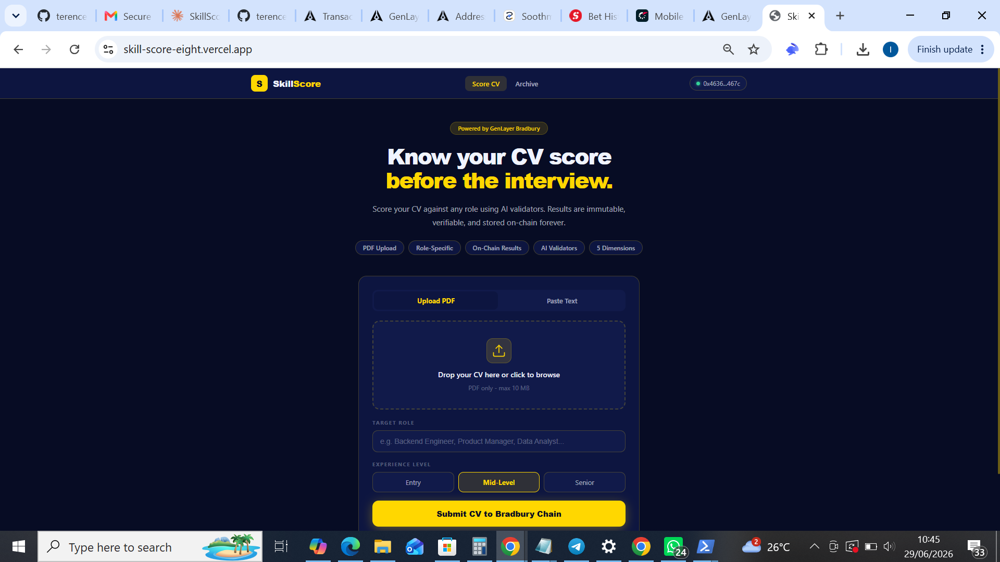
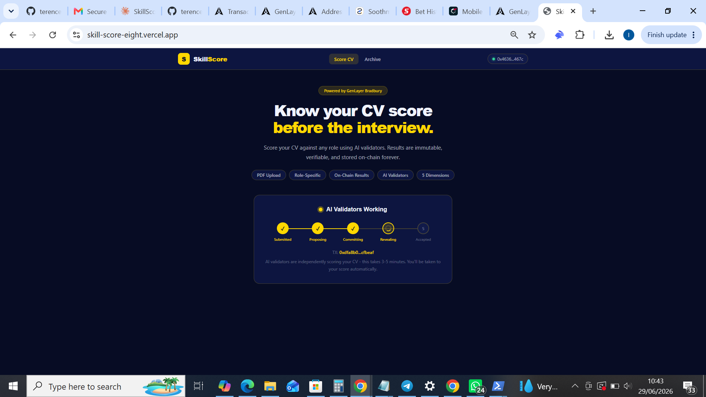
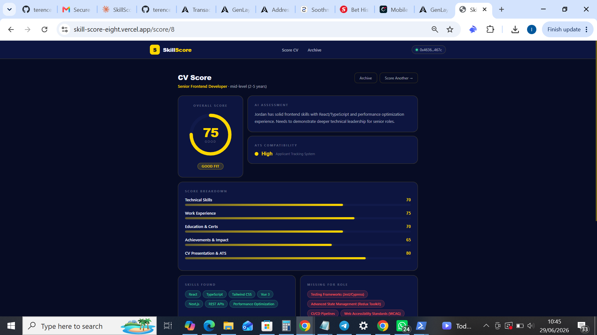
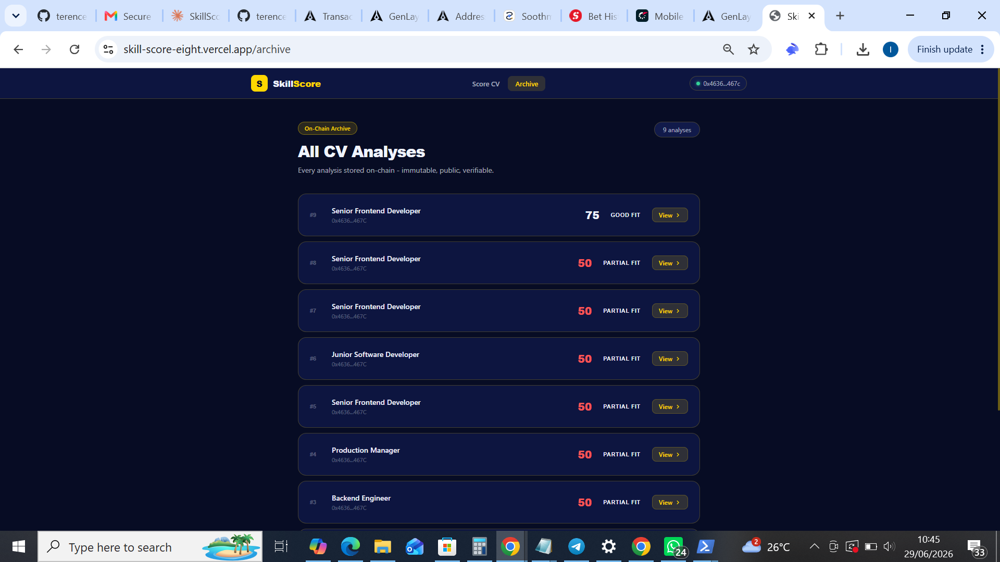

# SkillScore

**Know your CV score before the interview.**

SkillScore is a decentralized application (dApp) that scores your CV against any target role using AI validators on the [GenLayer](https://www.genlayer.com/) Bradbury Testnet. Every analysis is run through on-chain AI consensus and stored permanently — making each result immutable, transparent, and publicly verifiable.

🔗 **Live app:** [skill-score-eight.vercel.app](https://skill-score-eight.vercel.app)

---

## Screenshots

### Score a CV


### On-chain AI consensus in progress


### Your result


### On-chain archive


---

## What it does

Upload a CV (PDF) or paste it as text, pick a target role and experience level, and submit. A network of AI validators independently scores the CV across five dimensions and reaches consensus on the result. Because the scoring runs on-chain through GenLayer's Intelligent Contracts, no single party controls the outcome — the verdict is reproducible and tamper-proof.

### Five scoring dimensions
- **Technical Skills** — relevance and depth of technical ability for the role
- **Work Experience** — quality and relevance of professional history
- **Education & Certifications** — academic background and credentials
- **Achievements & Impact** — measurable results and accomplishments
- **CV Presentation & ATS** — clarity, structure, and applicant-tracking-system compatibility

Each analysis also returns an overall score, a fit verdict, found vs. missing skills for the role, key strengths, and concrete recommendations to improve.

---

## How it works

SkillScore is a three-page flow:

1. **Score CV** (`/`) — Submit a CV. After submission, a live tracker follows the consensus stages (Submitted → Proposing → Committing → Revealing → Accepted). When consensus completes, you're automatically taken to your result.
2. **Score page** (`/score/:id`) — A dedicated, shareable page showing the full scorecard for a single analysis.
3. **Archive** (`/archive`) — A public, on-chain record of every analysis ever submitted. Click any entry to open its score page.

---

## Tech stack

- **Smart contract:** Python Intelligent Contract on GenLayer
- **Frontend:** Vue 3 + TypeScript
- **Chain interaction:** genlayer-js
- **PDF parsing:** pdfjs-dist
- **Wallet:** Rabby / MetaMask (EVM)
- **Hosting:** Vercel

---

## On-chain details

| | |
|---|---|
| **Network** | GenLayer Bradbury Testnet |
| **Chain ID** | 4221 |
| **Contract** | `0xF8285C84D3bAd24340F3F936dcEC6d15F4a34367` |
| **Explorer** | [explorer-bradbury.genlayer.com](https://explorer-bradbury.genlayer.com) |

### Contract methods
- `submit_cv(cv_text, target_role, experience_level)` — submit a CV for scoring (write)
- `get_analysis(id)` — fetch a single analysis by id (view)
- `get_all_analyses()` — fetch all analyses (view)
- `get_user_latest(address)` — fetch the latest analysis for an address (view)
- `get_count()` — total number of analyses (view)

---

## Running locally

```bash
# install dependencies
npm install

# start the dev server
npm run dev
```

The app expects a `VITE_CONTRACT_ADDRESS` environment variable pointing at the deployed contract. A `.env` file is included with the current testnet address.

You'll need an EVM wallet (Rabby or MetaMask) connected to the GenLayer Bradbury Testnet to submit a CV or read from the Archive.

---

## Repository structure

```
src/
  App.vue              # app shell + navigation
  client.ts            # GenLayer client + chain helpers
  router/              # routes: /, /score/:id, /archive
  views/
    AnalyzeView.vue    # CV submission + consensus tracker
    ScoreView.vue      # individual score page
    ArchiveView.vue    # on-chain archive
scripts/               # one-off build/deploy scripts (not part of the app)
```

---

*Built on GenLayer — Intelligent Contracts with on-chain AI consensus.*
